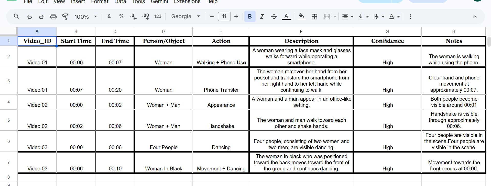
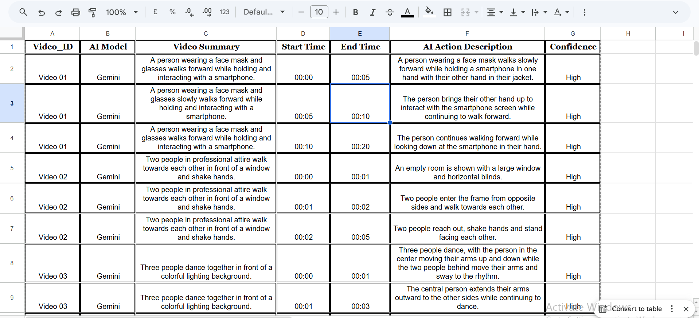
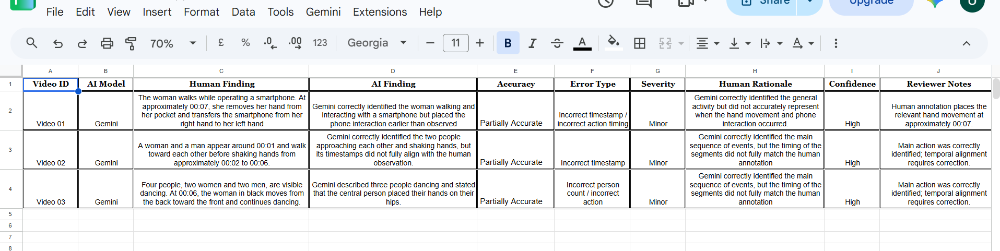
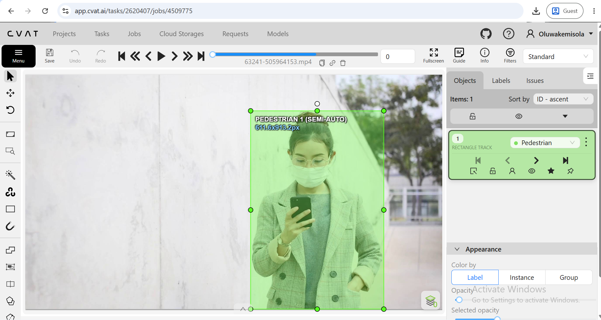
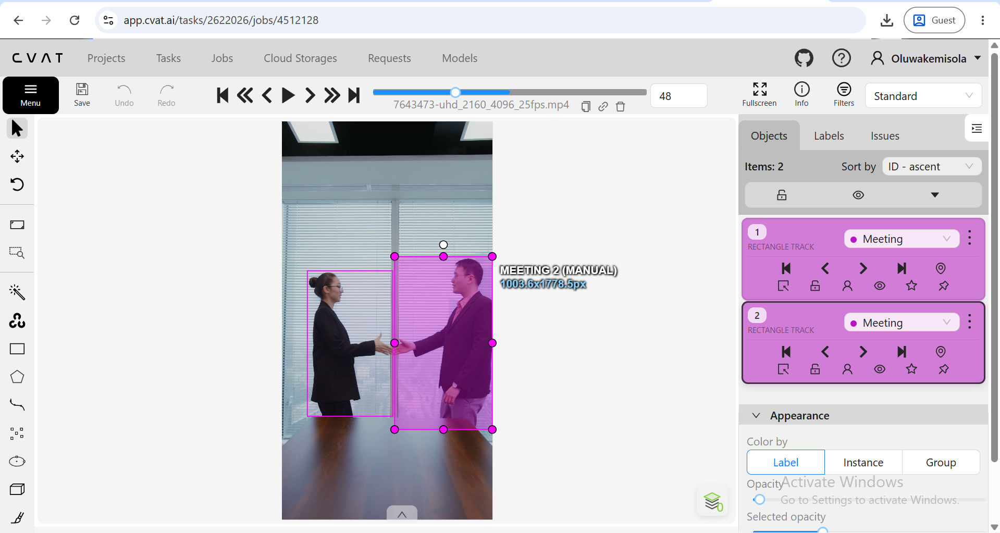
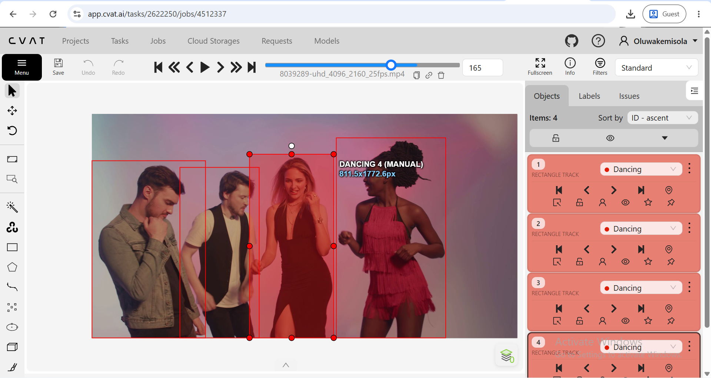

# Video Annotation & AI Output Evaluation
### Overview
* A hands-on video annotation and AI output evaluation project focused on video tracking, temporal annotation, action description, and human review of AI-generated video descriptions.
* I annotated three short videos using CVAT, recorded human observations and timestamps, then used Gemini to independently describe the same footage. I compared both outputs to identify factual, temporal, and action-level errors.
* The purpose was to test how well AI-generated descriptions matched what was actually visible in the videos and document where human review was needed.
  
### Annotation Approach
#### For each video, I recorded:
* Start and end timestamps
* People and relevant objects
* Visible actions
* Changes in activity
* Confidence level
* Additional notes
* The annotations follow a simple rule: describe what can be established from the footage rather than guessing.

### CVAT
* CVAT was used for:
* Person tracking
* Bounding-box annotation
* Frame-by-frame review
* Maintaining separate tracks for individual subjects
  
### Annotation export
Three videos were annotated in CVAT.
* AI Evaluation
* Gemini was used to generate independent descriptions of the same videos.
* The original AI responses were preserved separately from the human annotations and then reviewed against the actual footage.
  
#### Each output was classified as:
* Accurate
* Partially Accurate
* Inaccurate
* Specific issues were also recorded, including:
* Incorrect timestamps
* Incorrect person count
* Incorrect action
* Missing action
* Unsupported inference
* Incorrect subject attribution

### Key Findings
#### Video 01 — Pedestrian
* Gemini correctly identified the woman walking and interacting with a smartphone but placed the relevant phone interaction earlier than observed.
* Result: Partially Accurate
* Issue: Incorrect timestamp / action timing
#### Video 02 — Meeting
* Gemini correctly identified two people approaching each other and shaking hands, but its timestamps did not fully match the observed timing.
* Result: Partially Accurate
* Issue: Incorrect timestamp
#### Video 03 — Dancing
* The video contained four people, two women and two men. Gemini reported only three people and also described a hands-on-hips movement that was not observed during human review.
* Result: Partially Accurate
* Issues: Incorrect person count + incorrect action
These findings show why AI-generated video descriptions still benefit from careful human verification.

### Dataset
#### The project uses three structured datasets:
* Human Annotations
* Video ID
* Start Time
* End Time
* Person/Object
* Action
* Description
* Confidence
* Notes
* Gemini Output
* Video ID
* AI Model
* Video Summary
* Start Time
* End Time
* AI Action Description
* Uncertainty
* Final Evaluation
* Video ID
* AI Model
* Human Finding
* AI Finding
* Accuracy
* Error Type
* Severity
* Human Rationale
* Confidence
* Reviewer Notes

### Evidence
#### The repository includes supporting evidence of the work:

### Human Annotations

### Gemini Output

### Final Evaluation

### Pedestrian

### Meeting

### Dancing

* CVAT annotation exports
* Screenshots of the annotation and evaluation spreadsheets
* Short screen recordings of the CVAT tracking process
* Human annotation data
* Raw Gemini outputs
* Final AI evaluation data
* Annotation guidelines
* Tools

### CVAT: video annotation and tracking
 * Gemini: multimodal video description and evaluation
 * Google Sheets: annotation and QA dataset
 * GitHub: project documentation and version control

### What This Project Demonstrates
* Video annotation
* Temporal segmentation
* Person tracking
* Action description
* Timestamp accuracy
* Visual quality assurance
* AI output evaluation
* Error classification
* Written QA feedback
* Guideline-based review
* Attention to detail
* Structured data handling

### Project Structure
video-annotation-ai-evaluation/
README.md, cvat/, data/, guidelines/, screenshots/, recordings/

